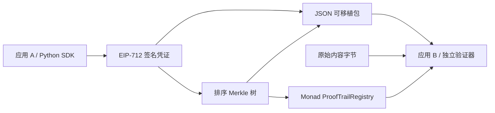

# 架构与凭证协议 v1

## 数据流

数据层不要求 ProofTrail 服务器常驻。链上记录发行者、根、叶子数量与登记时间；凭证持有者保管内容、签名、元数据、Merkle 路径。服务器 UI 只是便利入口。

## 签名声明

签名域：name=ProofTrail、version=1、chainId、verifyingContract。应用必须配置可信链与合约，不允许凭证指定任意 RPC 或自动改变可信域。

Receipt 字段：issuer（地址）、contentHash（SHA-256）、metadataHash（受约束 JSON 的 SHA-256）、parentId（上一版本凭证 ID，未设置为零）、salt（随机 32 字节）、issuedAt（发行者声明 Unix 秒）、expiresAt（0 表示不设期限）。协议 schema 固定版本并拒绝额外字段。

元数据仅含受约束字符串：title、mediaType、model、application。排序 key、UTF-8、紧凑 JSON，无数字/浮点，解决跨语言 JSON 数字规范化歧义。内容直接对输入字节哈希，不静默去空格、改换行或做 Unicode 归一化。

receiptId 为 EIP-712 digest；Merkle 叶子为 keccak256(receiptId)，与 64 字节节点输入做结构隔离；节点取两个 32 字节哈希按字节排序后拼接做 Keccak。奇数层最后节点复制，与对应证明保持一致；批内重复 receiptId 拒绝。

## 登记和撤销

登记者必须是凭证 issuer，独立验证同时比较链上 issuer 与签名恢复地址。batchId=keccak256(abi.encode(issuer, root))。合约拒绝空根、空批与重复根，不包含升级或管理员权限。

撤销按发行者与 receiptId 映射。任何人不能撤销他人的有效凭证；地址可以预先撤销自己的 ID。父凭证仅是发行者声明的版本关系，v1 不会递归推断父凭证的可信度或跨发行者版权。

## 验证输出

分别显示：schema、可信域、内容、元数据、签名、Merkle 证明、链上登记、撤销、有效期。仅所有检查通过才为有效；网络不可用为“无法确认”，不是“有效”。登记时间取区块链；issuedAt 是声明，不能作为可信创作时间。

## 模式

- local：EthereumTester/PyEVM 的真实 EVM 合约执行；演示测试账户签名；重启重置。
- monad：HTTP RPC 链 ID 必须为 10143，合约地址明确配置；不拿本地交易记录替代测试网证据。

## 官方技术依据

- EIP-712：https://eips.ethereum.org/EIPS/eip-712
- Monad 测试网：https://docs.monad.xyz/developer-essentials/testnet
- eth-account：https://eth-account.readthedocs.io/en/stable/eth_account.html
- web3.py：https://web3py.readthedocs.io/en/stable/providers.html

这些页面用于验证接口和网络信息。协议本身不承诺 C2PA 兼容、零知识证明或真实模型执行证明。
